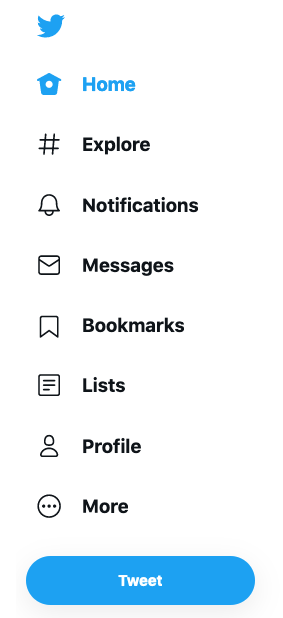
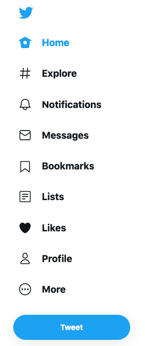

# Twitter Easy Likes

A browser extension (currently for [Firefox](https://www.mozilla.org/en-US/firefox/new/)) that display a link to Twitter "Likes" in the main user interface.

Twitter side navigation will change from this to this:

| Before                         | After                        |
| ------------------------------ | ---------------------------- |
|  |  |

## The Why

If you are visiting your Twitter likes too frequently, this extension will save you 2 clicks.

This can be useful in case you are using likes as a bookmark feature (because adding a Twitter bookmark requires too many clicks too 🤷‍♂️).

## TODO

- [ ] supporting Chrome too
- [ ] better supports for Twitter multiple theming options
- [ ] i18n
